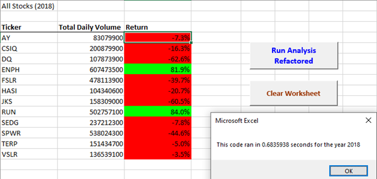

# Stock Analysis in VBA

## Overview of Project

## I: Purpose
This analysis’s purpose was to assist Steven, a recent finance graduate, in making an informed decision about investing his client’s money in the stock market. In this challenge, VBA code was already created and our task was to edit, or refactor, the dataset with VBA solution code to loop through the entire set of data one time to collect information regarding the stocks which will assist in Steve evaluating the stocks rate of success. After refactoring the data, we can determine whether the code we edited assisted in making the VBA script run more efficiently by condensing our code into fewer lines and therefore improving the code’s logic to make it easier for future users to read and use.
Analysis and Results

# Code and Analysis Results

## I: Examples of Code Used
	For this section, I have included the criteria required for the challenge as well as the code that was used with comments alongside them to provide simple explanations.

### A.	Created a tickerIndex variable and set it equal to zero before iterating over all the rows. Will use this tickerIndex to access the correct index across the four different arrays on VBA Code: the tickers array and the three output arrays created on next requirement.
```VBA
'Create a ticker Index
'The tickerIndex is set equal to 0 before looping over the rows.
    
   For i = 0 To 11
       tickerIndex = tickers(i)
```
### B.	 Created three output arrays, tickerVolumes, tickerStartingPrices, and tickerEndingPrices. Created three output arrays: tickerVolumes, tickerStartingPrices, and tickerEndingPrices. The tickerVolumes array should be a long data type. But in our VBA code the tickerStartingPrices and tickerEndingPrices arrays should be a Single data type.
```VBA
'Creates arrays with correct data type for tickers, tickerVolumes,
    'tickerStartingPrices, and tickerEndingPrices
    
    Dim tickerVolumes As Long
    Dim tickerStartingPrices As Single, tickerEndingPrices As Single
```
### C.	Created a loop to initialize tickerVolumes to 0. If the next row ticker does not match, then it will increase the volume for the current ticker.
```VBA
Worksheets(yearValue).Activate
       tickerVolumes = 0
       
       For j = 2 To RowCount
              
           
           'If the next row’s ticker doesn’t match, increase the tickerIndex.
           If Cells(j, 1).Value = tickerIndex Then
           
              
              'Increase volume for current ticker
              tickerVolumes = tickerVolumes + Cells(j, 8).Value
           
      
           End If
```
### D.	 Created a loop that will loop over all the rows in the spreadsheet. Inside the loop, we created a script that increases the current stock tickerVolumes variable and adds the ticker volume for the current stock ticker. Created and if-then statement to check if the current row is the first row with the tickerIndex selected. If it is, then the current closing price is assigned to the tickerStartingPrices and tickerEndingPrices Variable.
```VBA
'The script will loop through stock data, reading and storing all of the following values from each row:
        'tickers, tickerVolumes, tickerStartingPrices, and tickerEndingPrices
        
           If Cells(j - 1, 1).Value <> tickerIndex And Cells(j, 1).Value = tickerIndex Then

               'Store Starting Price Value
               tickerStartingPrices = Cells(j, 6).Value
               

           End If

           If Cells(j + 1, 1).Value <> tickerIndex And Cells(j, 1).Value = tickerIndex Then

               'Store Ending Price Value
               tickerEndingPrices = Cells(j, 6).Value
               

           End If
```
### E.	 Created code that will format the spreadsheet making positive returns green and negative returns red, to be a lot easier to determine which stocks were successful and which were not. 
```VBA
'Formats the cells correctly in the spreadsheet

           Worksheets("All Stocks Analysis").Activate
           
           Cells(4 + i, 2).Value = tickerIndex
           Cells(4 + i, 3).Value = tickerVolumes
           Cells(4 + i, 4).Value = tickerEndingPrices / tickerStartingPrices - 1
    
            'Fix % on return
            With Range("D4:D15")
                        .NumberFormat = "0.0%"
                        .Value = .Value
            End With
            

   Next i
 
   
    'Formatting
    Worksheets("All Stocks Analysis").Activate
    Range("B3:D3").Font.FontStyle = "Bold"
    Range("B3:D3").Borders(xlEdgeBottom).LineStyle = xlContinuous
    Range("C4:C15").NumberFormat = "#,##0"
    Range("C4:C15").NumberFormat = "0.0%"
    Columns("C").AutoFit

    dataRowStart = 4
    dataRowEnd = 15

    For i = dataRowStart To dataRowEnd
        
        If Cells(i, 4) > 0 Then
            
            Cells(i, 4).Interior.Color = vbGreen
            
        Else
        
            Cells(i, 4).Interior.Color = vbRed
            
        End If
```

## II: Dataset Analysis
	After dissecting the code, now have a better understanding of the data we are about to analyze and how it will be formatted. Our stock analysis outputs for 2017 and 2018 are correct when compared to the previous examples shown in the challenge. The code did run faster than before but not by a significant amount. However, our code is more legible than before and easier to understand as well as edit for future use.


Results and Time for VBA_Challenge_2017.PNG

 

Results and Time for VBA_Challenge_2018.PNG

 

## Summary
### I: Pros and Cons of Refactoring
In sum, refactoring data is a very useful tool to a data analyst by making small adjustments to code you already have access to. Each adjustment you make to your code makes your code slightly more efficient but more importantly more legible and does not bar access to someone who may not understanding coding. Another great feature one can accomplish while refactoring is using the comments feature to show your train of thought when working in VBA or any other coding languages.

#### Pros:	
-Addressing errors are easier as they appear in well written code that contains nested conditionals and loops.

-Using the Excel flow displays the program logic in a more legible way, it is not tied to the order that the underlying code is written.

-VBA interpretation (Excel) of code reveals patterns that are not easy to see in the source.

-Refactoring gives the user the opportunity to use the comments feature to make code more legible

#### Cons:	
-Refactoring is a long procedure in which the same line of code may be in several locations, you can change the logic to eliminate the duplicate lines.

-A logical structure may be duplicated in two or more procedures. This logic is best moved to a new function and called from the other functions.

-A complex unstructured code is usually best to split in several functions rather than all in one.

-Refactoring process can affect the testing outcomes and disrupt the original function of the code at times.

### II. Pros and Cons when refactoring the original VBA script?
The most important thing to keep in mind when refactoring code is that you are not seeking to change what your code is seeking to accomplish. Your code maintains the same functions that it did before but condensing and rewriting pieces of it can make things easier for the user in the long run. It is easy to see when refactoring is common practice because the reuse of code (I assume) is common. Going back to a code you have not worked with for some time may be confusing if it is not simple enough to understand. This is where refactoring and adding comments can be a major factor in helping an analyst complete their task(s) efficiently and without confusion. Keeping up with this kind of maintenance is however a large undertaking and this challenge was difficult for our first coding challenge. Practice is key to refactoring, and I believe it will get easier as we evaluate more code.
